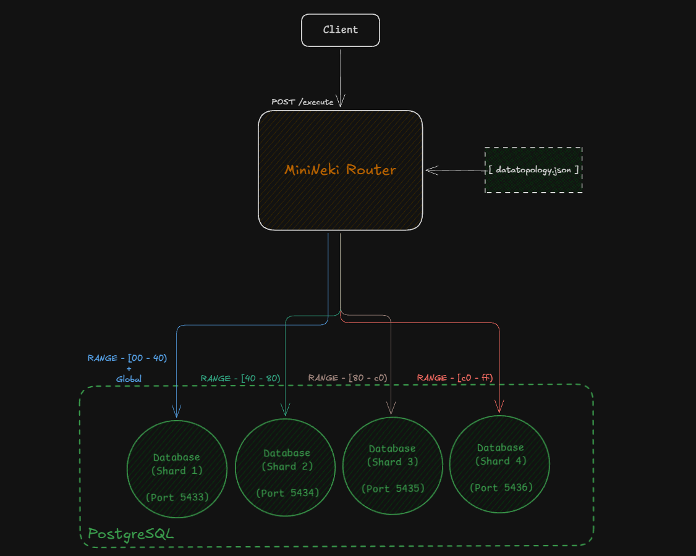

# MiniNeki

MiniNeki is a minimal sharded PostgreSQL router written in Go. It is an educational prototype built to understand the routing, partitioning, and colocation mechanics described in PlanetScale's article on Neki: [[The Lifecycle of a Sharded Postgres Query]](https://planetscale.com/blog/the-lifecycle-of-a-sharded-postgres-query).




## How It Works

A complete sharded database router like Neki implements three main stages:
1. **Parser**: Parses incoming SQL into an Abstract Syntax Tree (AST).
2. **Planner**: Inspects table definitions and key-ranges in the data topology to choose target shards.
3. **Executor**: Dispatches queries to connections, merges parallel streams, and returns results.

MiniNeki does not implement a SQL AST parser. Instead, the client sends a JSON payload with the target table, routing key, raw parameterized SQL query, and arguments. PostgreSQL itself compiles and executes the SQL. 

MiniNeki focuses on the planner and executor stages:

- if you went to the first commit you see i used Modulo sharding (`id % N`), well i was gonna call it a day with just that it was after that decided to implement the `xxhash64` why? b/c in production if you use modulo adding a shard forces reshuffling almost the entire database across the network. Instead, we use key-range partitioning, routing keys are hashed with `xxhash64` into uniform hex ranges (`00-40`, `40-80`, `80-c0`, `c0-ff`). If a shard gets too full, you only split that specific range without touching the rest of the cluster. its deterministic so given a key it will always route to the same shard unless you split the range and stuff
- The other thins i would say One of the biggest challenges in sharded relational databases is handling related tables. If parent and child rows end up scattered across different nodes, queries turn into slow distributed network headaches. Table colocation solves this by anchoring child tables (`orders`) to the parent's shard key (`customer_id`), so Alice and all her orders always land on the exact same physical shard (`shard3`) for fast, local joins.
- Small reference tables like `countries` make no sense to shard. They map to the unsharded `metadata` group and route straight to `shard1` without hashing or shard keys.
- What happens when a query has no shard key at all (like `SELECT * FROM customers`)? Querying just one shard would miss 75% of the data. So the router enters scatter-gather mode: it spins up concurrent Go goroutines to query all 4 Postgres shards in parallel, waits with a `sync.WaitGroup`, and merges all the rows into a single response.
- A background watcher checks `datatopology.json` for modifications. When key ranges or tables change, it hot-reloads the routing table into memory using `sync.RWMutex` without needing to restart the server or drop live connections.
- Thread-safe connection pooling is handled by `pgxpool.Pool` on each shard so concurrent queries execute safely without race conditions.


## Requirements

- Go 1.22+
- Docker and Docker Compose

## Setup

Start the 4 PostgreSQL shard instances:

```bash
docker compose up -d
```

This starts 4 PostgreSQL 16 containers on ports `5433`, `5434`, `5435`, and `5436`.

Start the router:

```bash
go run main.go
```

On startup, the program applies `schema.sql` to all shards, initializes connection pools, starts the topology watcher, and listens on `:8080`.

## Usage

Queries are sent as HTTP POST requests to `/execute`.

### 1. Point Insert (Single Shard)

Insert a customer with `id = 1`:

```bash
curl -s -X POST http://localhost:8080/execute \
  -H "Content-Type: application/json" \
  -d '{
    "table": "customers",
    "key": 1,
    "query": "INSERT INTO customers (id, name, email) VALUES ($1, $2, $3)",
    "args": [1, "Alice", "alice@example.com"]
  }'
```

Response:
```json
{"rows":1,"shard":"shard3","status":"Executed"}
```

Key `1` hashes to bucket `80-c0`, routing to `shard3`.

### 2. Colocated Insert

Insert an order for customer `1`:

```bash
curl -s -X POST http://localhost:8080/execute \
  -H "Content-Type: application/json" \
  -d '{
    "table": "orders",
    "key": 1,
    "query": "INSERT INTO orders (id, customer_id, total_amount) VALUES ($1, $2, $3)",
    "args": [101, 1, 99.99]
  }'
```

Response:
```json
{"rows":1,"shard":"shard3","status":"Executed"}
```

Because `orders` uses `customer_id` (`1`) as its routing key, it routes to `shard3` alongside Alice.

### 3. Colocated Join

Run a join across `customers` and `orders`:

```bash
curl -s -X POST http://localhost:8080/execute \
  -H "Content-Type: application/json" \
  -d '{
    "table": "customers",
    "key": 1,
    "query": "SELECT c.name, o.id AS order_id, o.total_amount FROM customers c JOIN orders o ON c.id = o.customer_id WHERE c.id = $1",
    "args": [1]
  }'
```

Response:
```json
{
  "count": 1,
  "data": [
    {
      "name": "Alice",
      "order_id": 101,
      "total_amount": 99.99
    }
  ],
  "shard": "shard3",
  "status": "OK"
}
```

### 4. Global Table Query

Insert into the unsharded `countries` table (no `key` provided):

```bash
curl -s -X POST http://localhost:8080/execute \
  -H "Content-Type: application/json" \
  -d '{
    "table": "countries",
    "query": "INSERT INTO countries (code, name) VALUES ($1, $2)",
    "args": ["ETH", "Ethiopia"]
  }'
```

Response:
```json
{"rows":1,"shard":"shard1","status":"Executed"}
```

`countries` belongs to the `metadata` shard group and is directed straight to `shard1`.

### 5. Scatter-Gather Query

Select all customers across the cluster without specifying a `key`:

```bash
curl -s -X POST http://localhost:8080/execute \
  -H "Content-Type: application/json" \
  -d '{
    "table": "customers",
    "query": "SELECT id, name, email FROM customers ORDER BY id",
    "args": []
  }'
```

Response:
```json
{
  "count": 4,
  "data": [
    {"email": "alice@example.com", "id": 1, "name": "Alice"},
    {"email": "bob@example.com", "id": 2, "name": "Bob"},
    {"email": "charlie@example.com", "id": 3, "name": "Charlie"},
    {"email": "diana@example.com", "id": 32, "name": "Diana"}
  ],
  "mode": "scatter-gather",
  "shards_queried": ["shard3", "shard4", "shard1", "shard2"],
  "status": "OK"
}
```

The router queries all 4 shards concurrently and merges the rows into a single response.

## Tests

Run the unit tests:

```bash
go test -v ./...
```
